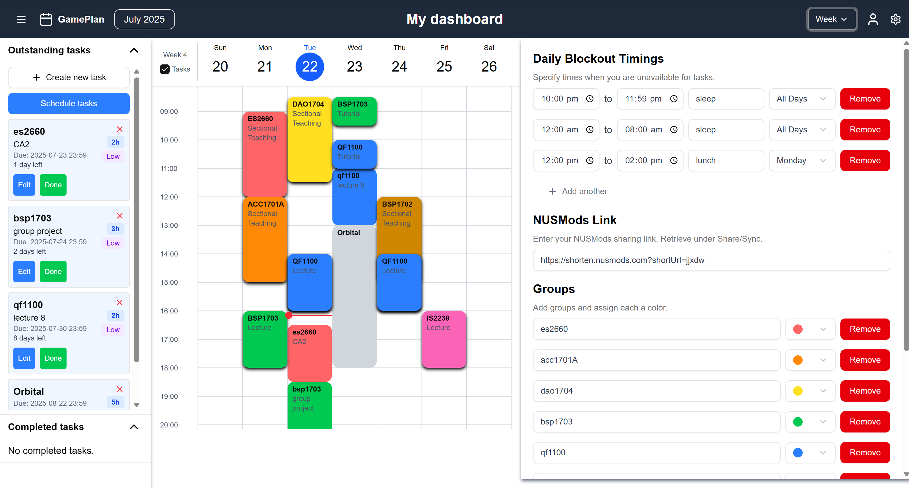

# GamePlan

GamePlan fetches your NUS timetable from NUSmods, then sorts out how you should spend each day completing the tasks you have piled up as a student in NUS. Your dashboard has an overview of the current week, complete with lessons (and yes! with week specific lesson population), scheduled tasks, blockout timings, and the ability to view friends' dashboards.



## A better overview

- [Full README documentation](https://docs.google.com/document/d/1-fI-Da-3rrYPoLs4FX-hB6yD8F0SVayCCcS9N2qy2rY/edit?usp=sharing)
- [Video demo / Poster](https://drive.google.com/drive/folders/10JEBWBxSNIpqfF1-sQ_8_gHCpJAO5URn)

## Live demo

Hosted on Render. Try it here -> [https://gameplan-frontend.onrender.com/](https://gameplan-frontend.onrender.com/)

## Setting it up locally

- [Node.js and npm installed](https://docs.npmjs.com/downloading-and-installing-node-js-and-npm/) (Node 18+ recommended)
- [Git installed](https://git-scm.com/downloads)

## Getting Started

1. **Clone the Repository**

   ```
   git clone https://github.com/IsaiahToh/GamePlan
   cd GamePlan
   ```

2. **Install client and server dependencies**

   ```
   # In /client
   npm install

   # In /server
   npm install
   ```

3. **Start the Client and Server**

   Start both the client and server in separate terminal windows or tabs:

   ```
   # In /client
   npm run dev

   # In /server
   npm start
   ```

## Tips

- Run both client and server in separate terminal windows, or set up a root-level script with [concurrently](https://www.npmjs.com/package/concurrently) if desired.
- Make sure to configure your environment variables as needed (see `.env.example` if provided).


## Project Structure

    GamePlan/
      client/
        # React frontend
      server/
        # Node/Express backend

---
